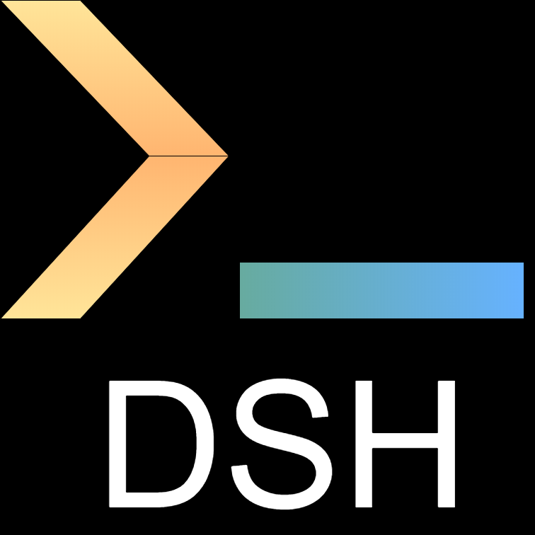

# Data Scientist Hub

**Data Scientist Hub (DSH)** is my personal knowledge center.

<!-- [=75% "current website progress 75%"]{: .candystripe .candystripe-animate} -->

DSH is definitely a living creature, always under development and I expect - and somehow _wish_ - frequent changes in both contents and shape.

It is currently implemented via [mkdocs](https://www.mkdocs.org/) with [material theme](https://squidfunk.github.io/mkdocs-material/) and deployed on [GitHub Pages](https://pages.github.com/).

You can visit the current deployed version [here](http://a-slice-of-py.github.io/data-scientist-hub/).

## Changelog

### v2.3

_Release date: Jun 18, 2022_

Several additions and improvements:

- move from setup.py to setup.cfg
- add Docker and Makefile support
- add tags plugin
- add Gource animation
- update Projects section

### v2.2

_Release date: Jan 19, 2022_

Move PAWS section under Notes.

### v2.1

_Release date: Jan 5, 2022_

Update with most up-to-date mkdocs-material features, brand new contents and appearance.

### v2.0

_Release date: Nov 02, 2020_

First DSH version as standalone mkdocs project.

### v1.0

_Release date: Mar 8, 2020_

Trello board named _"Resources"_, with topics as cards and links as checklist items.

### v0.1

_Release date: Jun 21, 2018_

Unorganized collection of links stored in random mails to myself.

## Commit types

From v2.1 on, commit messages _should_ follow a convention (as suggested by [Conventional Commits](https://www.conventionalcommits.org/en/v1.0.0/)) with below types:

- `feat` ➜ new project features
- `fix` ➜ bug fixing
- `data` ➜ contents update
- `refactor` ➜ light code refactoring
- `style` ➜ code style update
- `wip` ➜ backup commits
- `misc` ➜ none of the above

---

Copyright &copy; 2022 Silvio Lugaro
