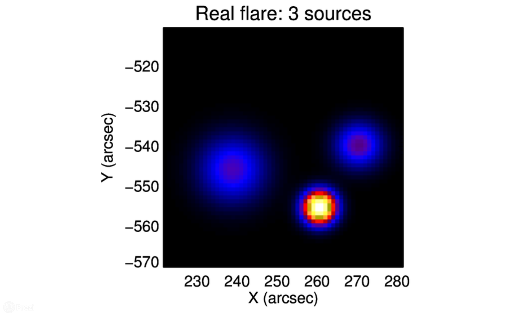

# 🏷️ About

🎓 Mathematician 🎸 Guitarist 🏕️ Hiker

Currently employed as Data Scientist.

## Maths

My master thesis about inverse imaging of solar flares by means of Sequential Monte Carlo samplers applied in a Bayesian framework can be found here [[ITA]](https://www.dima.unige.it/~sorrentino/Students/Tesi_Lugaro_Silvio.pdf).

<small>Real image &emsp; &emsp; &emsp; &emsp; &emsp; &emsp; &emsp; &emsp; &emsp; &emsp; &emsp; &emsp; &emsp; &emsp; &emsp; Reconstruction</small>

<video width="370"
       height="205"
       autoplay loop muted>
    <source src="../assets/reconstruction.mp4"
            type="video/mp4">
    Your browser does not support the video tag.
</video>

<small>SMC particles &emsp; &emsp; &emsp; &emsp; &emsp; &emsp; &emsp; &emsp; &emsp; &emsp; &emsp; &emsp; &emsp; &emsp; &emsp; Probability distribution of sources locations</small>

<video width="350"
       height="240"
       autoplay loop muted>
    <source src="../assets/particles.mp4"
            type="video/mp4">
    Your browser does not support the video tag.
</video>

<video width="350"
       height="240"
       autoplay loop muted>
    <source src="../assets/accumulator.mp4"
            type="video/mp4">
    Your browser does not support the video tag.
</video>

[Here](https://prezi.com/dx8zq6x2p-dq/bayesian-monte-carlo/) you can find some Prezi slides used in master thesis presentation.

<iframe src="https://prezi.com/embed/dx8zq6x2p-dq/"
        id="iframe_container"
        frameborder="0"
        webkitallowfullscreen=""
        mozallowfullscreen=""
        allowfullscreen=""
        allow="autoplay; fullscreen"
        height="315"
        width="100%">
</iframe>

[Here](https://arxiv.org/abs/1807.11287) you can find the resulting paper _"Sparse Bayesian Imaging of Solar Flares"_ co-authored with F. Sciacchitano and [A. Sorrentino](https://scholar.google.it/citations?user=nxXRxwUAAAAJ&hl=it).

## Music

[Here](https://radrocks.bandcamp.com/album/dieci) you can listen to some Genoa pop punk from RadRocks: lifetime friends I love to play with. <small>I amateurishly took care of recording, tracks mix and final master - please be kind.</small>

<iframe style="border: 0; width: 100%; height: 120px;"
        src="https://bandcamp.com/EmbeddedPlayer/album=704212375/size=large/bgcol=333333/linkcol=e99708/tracklist=false/artwork=small/transparent=true/" seamless>
        <a href="https://radrocks.bandcamp.com/album/dieci">DIECI by RadRocks</a>
</iframe>

## Books

Here is an unordered list of inspiring books I totally recommend:

- [_Everything and More: A Compact History of Infinity_](https://en.wikipedia.org/wiki/Everything_and_More_(book)) (David Foster Wallace)
- [_Perfect Rigor_](https://www.goodreads.com/book/show/6684592-perfect-rigor) (Masha Gessen)
- [_Cervelli che contano_](https://www.adelphi.it/libro/9788845929328) (Giorgio Vallortigara, Nicla Panciera)
- [_Fate il nostro gioco_](https://www.addeditore.it/catalogo/canova-rizzuto-fate-il-nostro-gioco/) (Paolo Canova, Diego Rizzuto)
- [_How to Lie with Statistics_](https://en.wikipedia.org/wiki/How_to_Lie_with_Statistics) (Darrell Huff)
- [_This Is Your Brain on Music_](https://en.wikipedia.org/wiki/This_Is_Your_Brain_on_Music) (Daniel J. Levitin)
- [_Le otto montagne_](https://www.einaudi.it/catalogo-libri/narrativa-italiana/narrativa-italiana-contemporanea/le-otto-montagne-paolo-cognetti-9788806226725/) (Paolo Cognetti)
- [_1Q84_](https://en.wikipedia.org/wiki/1Q84) (Haruki Murakami)
- [_Sophie's World_](https://en.wikipedia.org/wiki/Sophie%27s_World) (Jostein Gaarder)
- [_L'algoritmo e l'oracolo_](https://www.ilsaggiatore.com/libro/lalgoritmo-e-loracolo/) (Alessandro Vespignani)
- [_Tutta la solitudine che meritate_](https://www.quodlibet.it/libro/9788874626090) (Claudio Giunta, Giovanna Silva)
- [_Il libro dei vulcani d'Islanda_](https://iperborea.com/titolo/513/) (Leonardo Piccione)
- [_Due di due_](https://it.wikipedia.org/wiki/Due_di_due) (Andrea De Carlo)
- [_L'Assommoir_](https://en.wikipedia.org/wiki/L%27Assommoir) (Emile Zola)

## Places

Here is an unordered list of lovely places I totally recommend:

- [Hindeloopen, NL](https://goo.gl/maps/woJk3WX5opnLP7Pd7)
- [De Hoge Veluwe, NL](https://goo.gl/maps/9cNXnsJ7aTma5iz29)
- [Estaca de Bares, ES](https://goo.gl/maps/ErkVjiwnau4zxfhd6)
- [Cabo Fisterra, ES](https://goo.gl/maps/z6X6YRzzgTKaQ24s9)
- [Torri del Vajolet, IT](https://goo.gl/maps/N5B3krxFt2Dn87hu7)
- [Cala Brandinchi, IT](https://goo.gl/maps/LkMKovZuC4xbf5cK6)
- [Chianalea, IT](https://goo.gl/maps/QcFqVfjKu5vnrP8p9)
- [Cap Lardier, FR](https://goo.gl/maps/xWr4wuQkdEPwt7vH8)
- [Ostriconi, FR](https://goo.gl/maps/2aLzLaoMsDDVhr7n8)
- [Lago di Castello, IT](https://goo.gl/maps/wLzTAt8eRKR2QXCf9)
- [Porthleven, GB](https://goo.gl/maps/NPjUMH1eorfkUQhr7)
- [Mullion Cove, GB](https://goo.gl/maps/M6BwmjQeKfzwLNEe9)
- [Kamari, GR](https://goo.gl/maps/DKe3RCmPAoMMGZAv6)
- [Kerrera, GB](https://goo.gl/maps/AP1HaE8uV9CqMhXH9)
- [Laugar, IS](https://goo.gl/maps/acrbTDPCcUaaqckNA)
- [Hjörleifshöfði, IS](https://goo.gl/maps/pFqoAKHMeerEVvdf9)
- [Bonifacio, FR](https://goo.gl/maps/nhWXL9YuzPTyoyo66)
- [Capo Testa, IT](https://goo.gl/maps/s98qFdkYJxerokVZ8)
- [Vieste, IT](https://goo.gl/maps/VLTopVatDa3gpUuK6)
- [Rocca Calascio, IT](https://goo.gl/maps/EDTwNA1L4hWC3nGa6)
- [Rifugio Duca degli Abruzzi, IT](https://goo.gl/maps/9WyHekrV5in9aLf28)
- [Punta Helbronner, IT/FR](https://goo.gl/maps/udH6TpanTMdDFHUZ8)
- [Rifugio Questa, IT](https://goo.gl/maps/LyFYoDe274rUqamJ7)
- [Rifugio Mongioie, IT](https://goo.gl/maps/XFowRG5hPc7ufbX69)
- [Punta Manara, IT](https://goo.gl/maps/6zhjmKHLvMXv9MWA7)
- [Prato della Cipolla, IT](https://goo.gl/maps/VGfy4MDbQSX9EXre8)

## Foods

Here is an unordered list of wonderful restaurant I totally recommend:

- [_De Engelbewaarder_, Amsterdam, NL](https://goo.gl/maps/aE83t1pL5F5u3WzPA)
- [_U Fleku_, Prague, CZ](https://goo.gl/maps/KV9h2bhhtjBHCXAF7)
- [_Fatal Etterem_, Budapest, HU](https://goo.gl/maps/T6hZYd6evLsVFoJ77)
- [_La Sasima_, Arzachena, IT](https://goo.gl/maps/sUonzSM6HJV43SSQA)
- [_Osteria del Pescatore_, Tropea, IT](https://goo.gl/maps/JMHGexC47KALBaqZA)
- [_Elia_, Kamari, GR](https://goo.gl/maps/pMpCPUKFuNjWNiDq8)
- [_Cuan Mor_, Oban, GB](https://goo.gl/maps/H8PVH4y2upnP8bBT8)
- [_Kerrera Tea Garden & Bunkhouse_, Kerrera, GB](https://goo.gl/maps/VMunEYfzR2dhg4Le7)
- [_Scarpetta d'Oro_, Mattinata, IT](https://goo.gl/maps/pMi1NYeEGcprsQP76)
- [_La Maison de Filippo_, Entreves, IT](https://goo.gl/maps/dpbvcZMV1DoxKz6o7)
- [_Le Rune_, Genoa, IT](https://goo.gl/maps/bVUy6eznnfcDfDdU8)
- [_Antica Osteria da Zorro_, Chiavari, IT](https://g.page/anticaosteriadazorro?share)
- [_Fette Panissa_, Savona, IT](https://goo.gl/maps/fzQdCWtgoZDbj1jp8)
- [_Pakkhus_, Hofn, IS](https://goo.gl/maps/57CWVP2jwPJtM8h6A)
- [_Fjallakaffi_, Möðrudalur, IS](https://goo.gl/maps/JYwdMrdgsrYozxVD9)

---

You can find me on [GitHub](https://github.com/a-slice-of-py) or [Linkedin](https://it.linkedin.com/in/silviolugaro).
