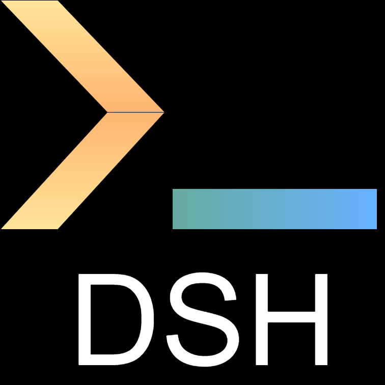

## Whatis

**Data Scientist Hub (DSH)** is my personal knowledge center.

DSH is definitely a living creature, always under development and I expect - and somehow _wish_ - frequent changes in both contents and shape.
It is currently implemented via [mkdocs](https://www.mkdocs.org/) with [material theme](https://squidfunk.github.io/mkdocs-material/) and deployed on [GitHub Pages](https://pages.github.com/).

It all started with random mails to myself to store somewhere useful links I came across, then became a Trello board and now is a full mkdocs project with a useful search feature to quickly retrieve references together with a brand new blog which I hope to update frequently - insipiration about TIL approach taken from [koaning](https://koaning.io/til/).

## Whois

I am a former [mathematician](https://arxiv.org/abs/1807.11287)[^1], amateur [singer, guitarist and music producer](https://radrocks.bandcamp.com/album/dieci) and casual [hiker](https://goo.gl/maps/XFowRG5hPc7ufbX69) - currently employed as Data Scientist.

You can find me on [GitHub](https://github.com/a-slice-of-py) or [Linkedin](https://it.linkedin.com/in/silviolugaro).

[^1]: For reference, [here](https://www.dima.unige.it/~sorrentino/Students/Tesi_Lugaro_Silvio.pdf) my master thesis and [here](https://prezi.com/dx8zq6x2p-dq/bayesian-monte-carlo/) some Prezi slides used during the final dissertation.

## Changelog

### v2.4

_Release date: Dec 27, 2023_

Lighter appearance and big refactor:

- upgrade `mkdocs-material` to latest version
- enable Git metadata
- move all notes under new Blog plugin
- move Snippets under Resources section
- refactor several resources pages
- remove legacy sections

### v2.3

_Release date: Jun 18, 2022_

Several additions and improvements:

- move from setup.py to setup.cfg
- add Docker and Makefile support
- add tags plugin
- add Gource animation
- update Projects section

### v2.2

_Release date: Jan 19, 2022_

Move PAWS section under Notes.

### v2.1

_Release date: Jan 5, 2022_

Update with most up-to-date mkdocs-material features, brand new contents and appearance.

### v2.0

_Release date: Nov 02, 2020_

First DSH version as standalone mkdocs project.

### v1.0

_Release date: Mar 8, 2020_

Trello board named _"Resources"_, with topics as cards and links as checklist items.

### v0.1

_Release date: Jun 21, 2018_

Unorganized collection of links stored in random mails to myself.
