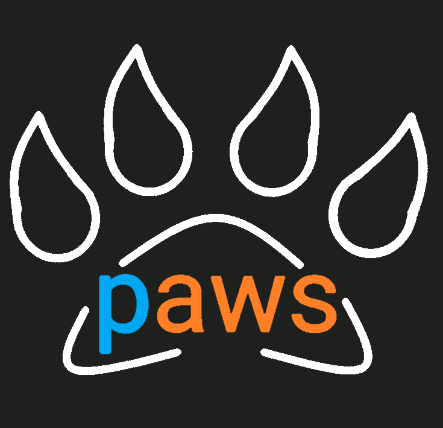

# PAWS



Practical Amazon Web Services. Practical AWS. Just **PAWS** 🐾: original tutorials and reports written while exploring the AWS ecosystem.

## AWS Chalice

[AWS Chalice](https://github.com/aws/chalice) is a microframework for writing serverless apps in Python.

### Comparison with SAM

The following table provides a mapping between AWS SAM and AWS Chalice commands:

<table>
<thead>
<tr class="header">
<th><p>Chalice</p></th>
<th><p>Main options</p></th>
<th><p>Notes</p></th>
<th><p>SAM equivalent</p></th>
</tr>
</thead>
<tbody>
<tr class="odd">
<td><p><code>chalice new-project </code><project_name></p></td>
<td></td>
<td><p>initialize an "hello world" sample project at the <i>dev</i> stage</p></td>
<td><p><code>sam init --name </code><project_name></p></td>
</tr>
<tr class="even">
<td><p><code>chalice deploy</code></p></td>
<td><p><code>--no-autogen-policy</code> to avoid auto policy generation, requires a source policy file <code>.chalice/policy-</code><stage_name><code>.json</code><br />
<code>--stage </code><stage_name> to set a different deployment stage (<i>dev</i> by default)</p></td>
<td><p>Chalice automatically builds apps, storing the build results in <code>.chalice/deployments/</code></p></td>
<td><p><code>sam build &amp;&amp; sam deploy</code></p></td>
</tr>
<tr class="odd">
<td><p><code>chalice local</code></p></td>
<td><p><code>--port=XXXX</code> to redirect local hosting on a specific port</p></td>
<td><p>locally run the app (by default on port 8000)</p></td>
<td><p>partially covered by <code>sam local invoke</code></p></td>
</tr>
<tr class="even">
<td><p><code>chalice invoke --name </code><lambda_name></p></td>
<td></td>
<td><p>invoke a Lambda function</p></td>
<td><p>partially covered by <code>sam local invoke</code></p></td>
</tr>
<tr class="odd">
<td><p><code>chalice gen-policy</code></p></td>
<td></td>
<td><p>redirect to stdout the auto-generated AWS policy for the defined app (useful as a starting template for <code>.chalice/policy-</code><stage_name><code>.json</code>)</p></td>
<td></td>
</tr>
<tr class="even">
<td><p><code>chalice delete</code></p></td>
<td></td>
<td><p>delete the deployed app</p></td>
<td></td>
</tr>
</tbody>
</table>

The following sample is the Chalice implementation equivalent of SAM project discussed [here](/data-scientist-hub/paws/#w-custom-local-module).

``` python
chalice-app/
│
├── .chalice/
│   ├── deployed/
│   │   └── <stage_name>.json
│   ├── deployments/
│   ├── policy-<stage_name>.json
│   └── config.json
│
├── chalicelib/
│   ├── __init__.py
│   └── custom_script.py
│
├── app.py
│
└── requirements.txt
```

where `app.py` contains (possibly) all the Lambda handlers, each one decorated with `@app.lambda_function(name='my_lambda_name')`, needed to let Chalice treat them as [pure Lambda functions](https://chalice.readthedocs.io/en/latest/topics/purelambda.html).

## AWS SAM

The AWS Serverless Application Model (AWS SAM) is an open-source framework that you can use to build serverless applications on AWS. A useful tutorial can be found [here](https://docs.aws.amazon.com/serverless-application-model/latest/developerguide/serverless-getting-started-hello-world.html).

### Build Lambda layers

Lambda layers builds can be automated through the code in [aws-lambda-layer](https://github.com/a-slice-of-py/aws-lambda-layer) repo. The idea is forcing AWS SAM to build layers in the same way it builds Lambdas as described [here](https://bryson3gps.wordpress.com/2018/12/06/trick-sam-into-building-your-lambda-layers/) and [here](https://stackoverflow.com/questions/58369170/build-custom-aws-lambda-layer-for-scikit-image/58408130#58408130).

The SAM app structure should look like the following:

``` bash
sam-app/
│
├── lambdas/
│   ├── __init__.py
│   ├── lambda_1.py
│   ├── lambda_2.py
│   └── requirements.txt
│
├── layers/
│   ├── __init__.py
│   ├── dummy_lambda.py
│   └── requirements.txt
│
└── template.yaml
```

You basically have to:

1. define a dummy Lambda function in `template.yaml` with a related `requirements.txt` which is supposed to contain the packages to be included in the layer;
2. define the related layer in `template.yaml` which _ContentUri_ must point to the build path of the dummy lambda;
3. modify any (actual) Lambda source code adding `sys.path.append('/opt')` before importing the required packages.

The addition made in the template should look like this:

``` yaml
  DummyLambda:
    Type: AWS::Serverless::Function
    Properties:
      CodeUri: layers/
      Handler: dummy_lambda.lambda_handler
  CustomLayer:
    Type: AWS::Serverless::LayerVersion
    Properties:
      LayerName: CustomLayer
      Description: Simple layer containing custom library
      ContentUri: ./.aws-sam/build/DummyLambda
      CompatibleRuntimes:
        - python3.7
        - python3.8
        - python3.9
      RetentionPolicy: Delete
    DependsOn: DummyLambda
```

#### w/ custom local module

The following methods are possible ways to overcome errors related to the import of custom local scripts within AWS Lambda functions, such as `attempted relative import with no known parent package`, `attempted relative import beyond top-level package`, etc.

!!! info
    [Here](https://stackoverflow.com/questions/14132789/relative-imports-for-the-billionth-time/14132912#14132912) you can find a complete overview of relative imports, difference between modules and scripts and more.

In the simplest case in which the custom script `custom_script.py` is a dependency of just one Lambda, it is sufficient to put it in the lambdas
folder, and importing it within the lambda source code with an _implicit relative import_ as `from custom_script import stuff`. The project tree looks like the following:

``` bash
sam-app/
│
├── lambda_1/
│   ├── __init__.py
│   ├── lambda_1.py
│   ├── custom_script.py
│   └── requirements.txt
│
├── lambda_2/
│   ├── __init__.py
│   ├── lambda_2.py
│   └── requirements.txt
│
├── layers/
│   ├── __init__.py
│   ├── dummy_lambda.py
│   └── requirements.txt
│
└── template.yaml
```

For further reference see [this gist](https://gist.github.com/gene1wood/06a64ba80cf3fe886053f0ca6d375bc0).

As of early 2020, it seems there's no standard/straightforward way to build a custom script as shared dependency across two or more lambdas. A possible workaround - inspired from [this thread](https://stackoverflow.com/questions/58402409/sam-build-does-it-also-build-layers) - consists in exploiting the (possibly already created) dummy lambda. Since SAM builds every lambda within the app root folder, you can put the custom script within dummy lambda folder, and import the script with an _implicit relative import_ in the dummy lambda source code, such as `import custom_script`. When SAM builds the layer associated to the dummy lambda, your custom script will be included within the layer as well and can be served as dependecy across all lambdas.

The project tree looks like the following:

``` bash
sam-app/
│
├── lambda_1/
│   ├── __init__.py
│   ├── lambda_1.py
│   └── requirements.txt
│
├── lambda_2/
│   ├── __init__.py
│   ├── lambda_2.py
│   └── requirements.txt
│
├── layers/
│   ├── __init__.py
│   ├── dummy_lambda.py
│   ├── custom_script.py
│   └── requirements.txt
│
└── template.yaml
```
