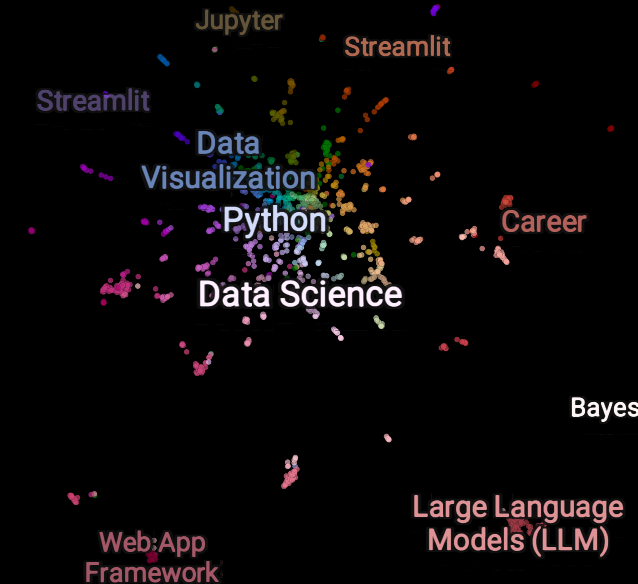
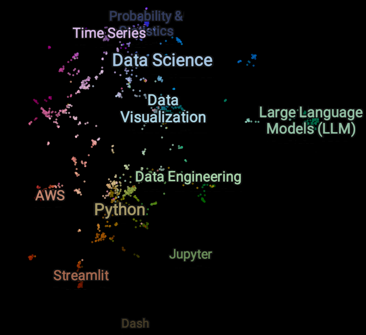
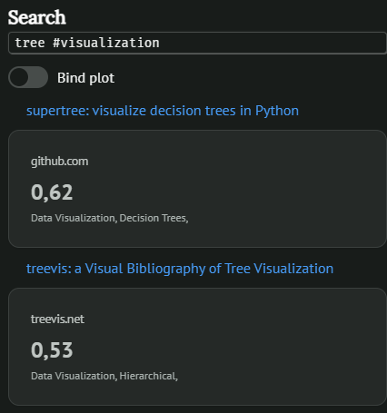
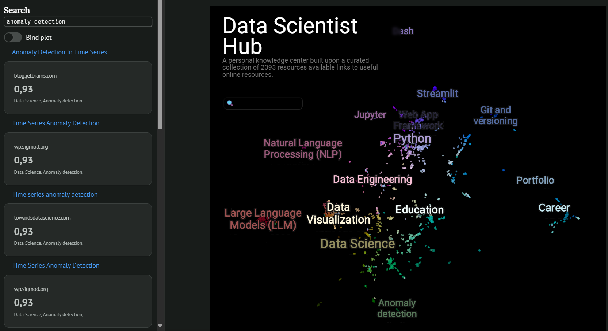

# Improving the DSH search experience

In the past months I thought more and more frequently about how to improve the _usability_ of all the ~2500 resources I carefully curate here on DSH.

In this post, I detail the design, development and final result of an interactive semantic search and visualization system for my personal knowledge center, built upon modern technologies like [marimo](https://github.com/marimo-team/marimo), [model2vec](https://github.com/MinishLab/model2vec) and [datamapplot](https://github.com/TutteInstitute/datamapplot).

<!-- more -->

<iframe width="900"
        height="650"
        scrolling="no"
        frameborder="0"
        src="../../../../assets/dsh_datamapplot.html">
</iframe>

## Motivations

I built DSH in late 2020 to give shape and structure(1) to all the interesting data-related links I came in touch with, and I still find really useful to have a curated collection of online resources which spans over my professional and personal interests.(2)
{ .annotate }

1. Despite I'm probably still feeding it also to placate a combination of [OCD](https://en.wikipedia.org/wiki/Obsessive%E2%80%93compulsive_disorder) and [FOMO](https://en.wikipedia.org/wiki/Fear_of_missing_out).
2. Even if the idea of [delete everything](https://www.joanwestenberg.com/p/i-deleted-my-second-brain) starts to tickle me.

The built-in search of mkdocs-material is already a good way to enable full text search[^1] through DSH and has some good [configuration options](https://squidfunk.github.io/mkdocs-material/plugins/search/#search)(1), but in the LLM era - where most of the information retrieval tasks are performed through natural language and agentic interactions - a search bar without semantic search capabilities seems too limited.
{ .annotate }

1. And even some [tweaking](https://github.com/squidfunk/mkdocs-material/discussions/8116#discussioncomment-12632752) is available!

Since I wanted to start simple and add complexity little by little, I decided to do some good old experimentation before unleashing a coding assistant with a still vague request such as _"please improve the search experience of my static website"_ (how? where? why?!).

## Index creation

First of all, I had to extract all the links from the source Markdown files and put them in a more convenient format for data analysis.

I chose JSON format and wrote a little parser to build an `index.json`: nothing fancy here, but I took care to bring other simple metadata in the index for each link, such as the _category_ (section here on DSH), the _topic_ (filename where the link has been stored) and eventual _section_ (file subheader) - see sample below.

<div>
<small>
```json
[
  {
      "category": "Python",
      "topic": "Documentation",
      "section": "mkdocs",
      "link_name": "Python markdown terminal built for mkdocs",
      "url": "https://github.com/mkdocs-plugins/termynal"
  },
  {
      "category": "Data Science",
      "topic": "Time Series",
      "section": null,
      "link_name": "Pattern mining with `stumpy`",
      "url": "https://towardsdatascience.com/part-8-ab-joins-with-stumpy-af985e12e391"
  },
  {
      "category": "Misc",
      "topic": "Mathematics",
      "section": "Topology",
      "link_name": "Community network detection with Ricci flow and surgery on graphs",
      "url": "https://graphriccicurvature.readthedocs.io/en/latest/tutorial.html"
  }
]
```
</small>
</div>

## New search design

### Embeddings

Being a data professional fluent in Python, experimentation nowadays means [marimo](https://github.com/marimo-team/marimo), so I spinned up a new notebook.

To abide by the "start simple" requirement, the first choice for embeddings has been TF-IDF, and I opted for [embetter.text.learn_lite_text_embeddings](https://koaning.github.io/embetter/applications/#lite-embeddings) implementation which wraps it in a convenient way together with LSA (via [TruncatedSVD](https://scikit-learn.org/stable/modules/decomposition.html#truncated-singular-value-decomposition-and-latent-semantic-analysis)).

For each element in the index, the actual data passed to the embedding pipeline is the concatenation of category, section, topic and link name, chained together to resemble an actual sentence with the following template `{category} {topic}, {section}: {link_name}`. The input sentences corresponding to the sample index entries above are therefore:

<div>
<small>
```
Python Documentation, mkdocs: Python markdown terminal built for mkdocs.
Data Science Time Series: Pattern mining with `stumpy`.
Misc Mathematics, Topology: Community network detection with Ricci flow and surgery on graphs.
```
</small>
</div>

After having played a bit with TF-IDF embeddings, I decided to take the chance to experiment with [model2vec](https://github.com/MinishLab/model2vec) by MinishLab: I went for their flagship model [potion-base-8M](https://huggingface.co/minishlab/potion-base-8M), which results in a very small model on disk (~30 MB) stored via [safetensors](https://github.com/huggingface/safetensors).

??? question "What is the effect on 2D visualization?"

    Here there is a visual comparison between basic embeddings and model-distilled ones, after UMAP projection with euclidean metric.
    
    Both embedding models allow some clusters to emerge (e.g. the LLM "island"), but only the latter seems to guarantee a better separation between all the labelled categories.

    /// html | div[style='float: left; width: 50%;']
    <figure markdown="span">
      { width="300" }
      <figcaption>TF-IDF + LSA</figcaption>
    </figure>
    ///

    /// html | div[style='float: right;width: 50%;']
    <figure markdown="span">
      { width="300" }
      <figcaption>potion-base-8M</figcaption>
    </figure>
    ///

    /// html | div[style='clear: both;']
    ///

### Query syntax

I wanted the new search system to support following features: be capable of excluding terms from the search _and_ restricting the search to given categories.

For the first requirement, I chose a syntax loosely inspired by Google search: using `-` in a search query penalize search results that match with the term which follows.

!!! example annotate
    The query `time -series` returns the most representative results (1) related to "text" but which have little or no semantic relationship with the term "series".

1. With respect to cosine similarity between the query and the index embeddings.

For the second requirement, I implemented a simple filter logic: using `#` in a search restricts the results to only those belonging to the specified categories.

!!! example
    The query `tree #visualization` returns results semantically similar to "tree" found in "data visualization" category.

### Search interface

Given that I was already coding into a marimo notebook, I chose to stay in the same environment to build the search interface, at least for the moment. I implemented a simple search bar with [`mo.ui.text`](https://docs.marimo.io/api/inputs/text/#marimo.ui.text) placed into marimo sidebar, and the top 10 search results are then displayed vertically underneath, each one being a [`mo.stat`](https://docs.marimo.io/api/layouts/stat/#marimo.stat) implemented as follows:

=== "Source code"

    ```python
    def display_stat(item: pd.Series) -> mo.Html:
        return mo.vstack(
            [
                mo.md(f"[{item['link_name']}]({item['url']})"),
                mo.stat(
                    caption=", ".join(
                        [
                            item["category"],
                            (item["topic"] or ""),
                            (item["section"] or ""),
                        ]
                    ),
                    value=item[
                        "similarity"
                        if not terms_to_ignore
                        else "compound_similarity"
                    ],
                    bordered=True,
                    label=item["url"].split("://")[-1].split("/")[0],
                ),
            ]
        )
    ```

=== "Rendered layout"

    <figure markdown="span">      
      
    </figure>

## Visualization

### Projection in 2D

Having used [BERTopic](https://github.com/MaartenGr/BERTopic) in the last years, I chose [UMAP](https://github.com/lmcinnes/umap) to project the high-dimensional embeddings into 2D and prepare them for visualization. As of now, the only customization of hyperparameters has been the selection of _cosine_ metric instead of euclidean one.

### DataMapPlot

DataMapPlot is a powerful tool to create stunning "enhanced scatterplot", both static and interactive, with a specific focus on text embeddings. I went for the interactive version of the plot with the following configuration:

<div class="annotate" markdown>
- the labels for the different level of resolution are, respectively, _category_, _topic_ and _section_ (see [above](#index-creation))(1);
- the hover text is the _link name_, and there is a binding on the `on_click` event to open the corresponding URL;
- the in-plot search is enable and performs the search versus the `link_name` field;
- a selection handler can be triggered with ++shift+left-button++ to perform lasso selection and obtain 10 samples from the selected region, listed in a popup on the right side.
</div>

1. Labelling each link I add to DSH, despite all the time spent, seems now to have been a rewarding task!

### Search binding

As a last feature, I added a [`mo.ui.switch`](https://docs.marimo.io/api/inputs/switch/#marimo.ui.switch) to optionally bind the plot with search results. The logic is simple:

- if the switch is active, a set of _relevant points_ is selected as the set of points for which the relevance, i.e. cosine similarity, versus the search query is at least 50% of the relevance of the most relevant one;
- this set of points is then used to filter the visualization, displaying only the points which belong to the set.

## Next steps

<figure markdown="span">
  
  <figcaption>New search system layout</figcaption>
</figure>

I'm pretty happy with the final result, but I already have some additions in mind:

1. experiments for a further [reduction of Minishlab models size](https://minish.ai/blog/2025-10-05-size-blogpost);
2. embed the marimo app directly into DSH, to allow enhanced search online[^2];
3. compare the current implementation with a full BERTopic pipeline;
4. integrate an LLM to further improve search experience.

[^1]: This implementation is based on [lunr.py](https://github.com/yeraydiazdiaz/lunr.py).
[^2]: Unfortunately, WASM-based embedding isn't a solution as of now, mainly because a lot of packages I used aren't available in [pyodide list](https://pyodide.org/en/stable/usage/packages-in-pyodide.html).
