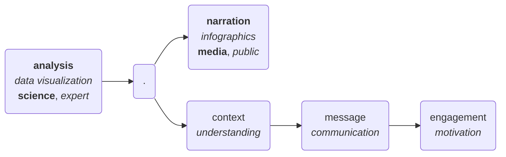

# DVSS - Day 2

Day 2 _on the fly_ notes of MaLGa's Data Visualization Summer School 2025.

<!-- more -->

- creator of RAWGraphs for sankey diagram construction from a spreadsheet
- hans rosling (gapminder data live explanation)
- non-autonomy principle: vis as a trigger for cognitive processes (generate insights, knowledge is not there)

## Data Visualization - a designerly approach

- design as a mean to create connections between disciplines (e.g. design thinking, research through design, ...)
- metaphores: gold, oil, natural resource, raw data
- ~~extract~~ wisdom ~~from~~ data -> _build_ wisdom _with_ data
- 70% of human "sensors" connected to eyes, 50% of brain processes related to visual processing
- pre-attentive processes to reduce cognitive workload

### Origins and rationales

- cartesian plane (descartes)
- time series (prestley)
- bar chart, pie chart (playfair)
- data over geographic maps, flowchart (minard)
- willard brinton, "graphic methods for presenting facts"

<figure>
    
    <figcaption>https://datavizblog.com/2013/05/26/dataviz-history-charles-minards-flow-map-of-napoleons-russian-campaign-of-1812-part-5/</figcaption>
</figure>

- hack the visual pattern

    1. explore visuals other than the available standard ones
    2. integrate variables and different visuals with each other

- some people started to break the ivory tower and have an impact on decision-makers through data visualization:

    - Florence Nightingale, mid 1800
    - London cholera map of John Snow, mid 1800 (ref. Snow, the movie)
    - treemap (Hewes and Gannett, mid 1800), but it's been included in MS Excel only in 2016

### The information design continuum

- business need: fast analytics, Tableau, BI, dashboard (board of primitive cars to protect the driver from dashes)
- Edward Tufte: data-ink ratio
- **but**: if you have a purpose, violate the data-ink ration is more than possible!
- data art
- different users: data expert, domain expert, policy maker, activist, citizen (ordered by reluctancy wrt. the message being conveyed)
- visualization as translation, a matter of language

### Design hybrid experiences

- martini glass narrative model
- data physicalization/sonification (evocative data art)
    - https://www.icad2019.icad.org/wp-content/uploads/2019/06/ICAD_2019_paper_44.pdf
    - https://sonifying.github.io/UNDERSTANDING-CYBER-ATTACKS-ON-WATER-SUPPLY-SYSTEMS/index.html
    - https://ginevraterenghi.github.io/presentazione-prog/index.html
    - http://listen.hatnote.com/#it

## Rhetorical Data Visualization

- world -> measured data -> transformed data -> vis -> delivery -> perception
        data reality gaps - data transformation - visual representation - contextual factors
- vis = efficiency + reduction in uncertainty
- rhetorical -> to build persuasive arguments
- there is always a frame (questions asked, data used, selected, graph choice, ...)
    - different data can be framed in different ways to support different storytelling
    - but some data/vis are more truthful than others! (reliability spectrum)

### Objectives

1. mindfulness about data framing
2. assessing validity
3. developing frames w/ integrity
4. common language to disagree constructively

- develop a systematic approach to map data transformations to narrative frames (designer would benefit to predict what readers will extract, readers will assess the relaibility of a frame)

#### Variable selection and grouping

#### Aggregation statistics

- sum/counts -> beware of the "base rate bias"
- average(s)
    - hide distribution shape and variability
    - sensitivity to sample size
- percentages and rates
    - percentage point vs change

#### Filtering and range effects

- variable selection vs values filtering

#### Granularity

- binsize
