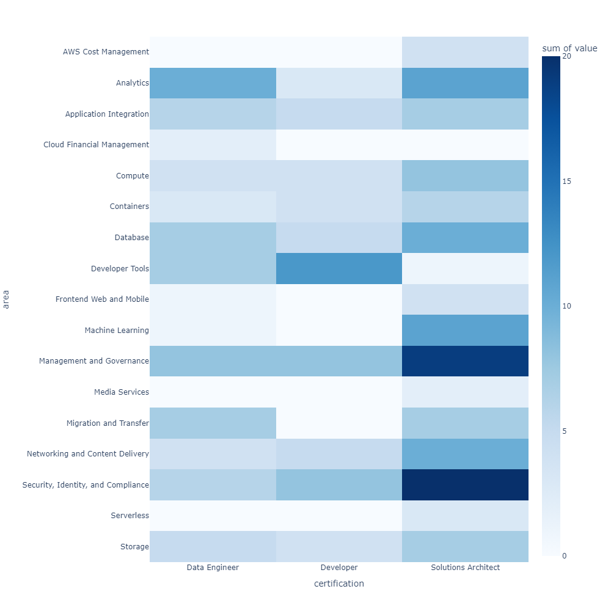
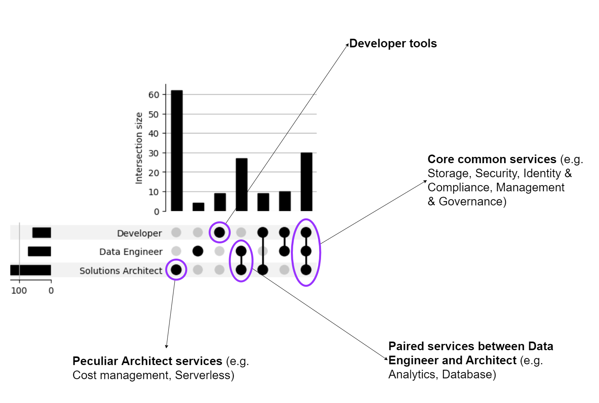

# A visual comparison of AWS Certifications

Following my [previous post](/data-scientist-hub/2024/01/29/aws-certification-skill-tree/), the quest for AWS Certifications continues.

In this episode, my goal is to quantitatively compare the three Associate certifications I'm focusing on: Solutions Architect, Developer and Data Engineer. So, I did some scraping to extract the exhaustive list of AWS services in scope for each certifications for the time being.

<!-- more -->

## Gathering the data

The first data-gathering attempt consisted in using [`pypdf`](https://github.com/py-pdf/pypdf) to extract text from [exams guides](https://d1.awsstatic.com/training-and-certification/docs-sa-assoc/AWS-Certified-Solutions-Architect-Associate_Exam-Guide.pdf): unfortunately, the result after few minutes of experiments wasn't good enough, so I manually copied the lists that can be found in the _"In-scope AWS services and features"_ section of each guide's Appendix.

After some processing, I obtained the following JSON:

??? example "services.json"
    ```JSON
    {
        "Solutions Architect": {
            "Analytics": [
                "Amazon Athena",
                "AWS Data Exchange",
                "AWS Data Pipeline",
                "Amazon EMR",
                "AWS Glue",
                "Amazon Kinesis",
                "AWS Lake Formation",
                "Amazon Managed Streaming for Apache Kafka (Amazon MSK)",
                "Amazon OpenSearch Service",
                "Amazon QuickSight",
                "Amazon Redshift"
            ],
            "Application Integration": [
                "Amazon AppFlow",
                "AWS AppSync",
                "Amazon EventBridge",
                "Amazon MQ",
                "Amazon Simple Notification Service (Amazon SNS)",
                "Amazon Simple Queue Service (Amazon SQS)",
                "AWS Step Functions"
            ],
            "AWS Cost Management": [
                "AWS Budgets",
                "AWS Cost and Usage Report",
                "AWS Cost Explorer",
                "Savings Plans"
            ],
            "Compute": [
                "AWS Batch",
                "Amazon EC2",
                "Amazon EC2 Auto Scaling",
                "AWS Elastic Beanstalk",
                "AWS Outposts",
                "AWS Serverless Application Repository",
                "VMware Cloud on AWS",
                "AWS Wavelength"
            ],
            "Containers": [
                "Amazon ECS Anywhere",
                "Amazon EKS Anywhere",
                "Amazon EKS Distro",
                "Amazon Elastic Container Registry (Amazon ECR)",
                "Amazon Elastic Container Service (Amazon ECS)",
                "Amazon Elastic Kubernetes Service (Amazon EKS)"
            ],
            "Database": [
                "Amazon Aurora",
                "Amazon Aurora Serverless",
                "Amazon DocumentDB (with MongoDB compatibility)",
                "Amazon DynamoDB",
                "Amazon ElastiCache",
                "Amazon Keyspaces (for Apache Cassandra)",
                "Amazon Neptune",
                "Amazon Quantum Ledger Database (Amazon QLDB)",
                "Amazon RDS",
                "Amazon Redshift"
            ],
            "Developer Tools": [
                "AWS X-Ray"
            ],
            "Frontend Web and Mobile": [
                "AWS Amplify",
                "Amazon API Gateway",
                "AWS Device Farm",
                "Amazon Pinpoint"
            ],
            "Machine Learning": [
                "Amazon Comprehend",
                "Amazon Forecast",
                "Amazon Fraud Detector",
                "Amazon Kendra",
                "Amazon Lex",
                "Amazon Polly",
                "Amazon Rekognition",
                "Amazon SageMaker",
                "Amazon Textract",
                "Amazon Transcribe",
                "Amazon Translate"
            ],
            "Management and Governance": [
                "AWS Auto Scaling",
                "AWS CloudFormation",
                "AWS CloudTrail",
                "Amazon CloudWatch",
                "AWS Command Line Interface (AWS CLI)",
                "AWS Compute Optimizer",
                "AWS Config",
                "AWS Control Tower",
                "AWS Health Dashboard",
                "AWS License Manager",
                "Amazon Managed Grafana",
                "Amazon Managed Service for Prometheus",
                "AWS Management Console",
                "AWS Organizations",
                "AWS Proton",
                "AWS Service Catalog",
                "AWS Systems Manager",
                "AWS Trusted Advisor",
                "AWS Well-Architected Tool"
            ],
            "Media Services": [
                "Amazon Elastic Transcoder",
                "Amazon Kinesis Video Streams"
            ],
            "Migration and Transfer": [
                "AWS Application Discovery Service",
                "AWS Application Migration Service",
                "AWS Database Migration Service (AWS DMS)",
                "AWS DataSync",
                "AWS Migration Hub",
                "AWS Snow Family",
                "AWS Transfer Family"
            ],
            "Networking and Content Delivery": [
                "AWS Client VPN",
                "Amazon CloudFront",
                "AWS Direct Connect",
                "Elastic Load Balancing (ELB)",
                "AWS Global Accelerator",
                "AWS PrivateLink",
                "Amazon Route 53",
                "AWS Site-to-Site VPN",
                "AWS Transit Gateway",
                "Amazon VPC"
            ],
            "Security, Identity, and Compliance": [
                "AWS Artifact",
                "AWS Audit Manager",
                "AWS Certificate Manager (ACM)",
                "AWS CloudHSM",
                "Amazon Cognito",
                "Amazon Detective",
                "AWS Directory Service",
                "AWS Firewall Manager",
                "Amazon GuardDuty",
                "AWS IAM Identity Center (AWS Single Sign-On)",
                "AWS Identity and Access Management (IAM)",
                "Amazon Inspector",
                "AWS Key Management Service (AWS KMS)",
                "Amazon Macie",
                "AWS Network Firewall",
                "AWS Resource Access Manager (AWS RAM)",
                "AWS Secrets Manager",
                "AWS Security Hub",
                "AWS Shield",
                "AWS WAF"
            ],
            "Serverless": [
                "AWS AppSync",
                "AWS Fargate",
                "AWS Lambda"
            ],
            "Storage": [
                "AWS Backup",
                "Amazon Elastic Block Store (Amazon EBS)",
                "Amazon Elastic File System (Amazon EFS)",
                "Amazon FSx (for all types)",
                "Amazon S3",
                "Amazon S3 Glacier",
                "AWS Storage Gateway"
            ]
        },
        "Developer": {
            "Analytics": [
                "Amazon Athena",
                "Amazon Kinesis",
                "Amazon OpenSearch Service"
            ],
            "Application Integration": [
                "AWS AppSync",
                "Amazon EventBridge",
                "Amazon Simple Notification Service (Amazon SNS)",
                "Amazon Simple Queue Service (Amazon SQS)",
                "AWS Step Functions"
            ],
            "Compute": [
                "Amazon EC2",
                "AWS Elastic Beanstalk",
                "AWS Lambda",
                "AWS Serverless Application Model (AWS SAM)"
            ],
            "Containers": [
                "AWS Copilot",
                "Amazon Elastic Container Registry (Amazon ECR)",
                "Amazon Elastic Container Service (Amazon ECS)",
                "Amazon Elastic Kubernetes Service (Amazon EKS)"
            ],
            "Database": [
                "Amazon Aurora",
                "Amazon DynamoDB",
                "Amazon ElastiCache",
                "Amazon MemoryDB for Redis",
                "Amazon RDS"
            ],
            "Developer Tools": [
                "AWS Amplify",
                "AWS Cloud9",
                "AWS CloudShell",
                "AWS CodeArtifact",
                "AWS CodeBuild",
                "AWS CodeCommit",
                "AWS CodeDeploy",
                "Amazon CodeGuru",
                "AWS CodePipeline",
                "AWS CodeStar",
                "Amazon CodeWhisperer",
                "AWS X-Ray"
            ],
            "Management and Governance": [
                "AWS AppConfig",
                "AWS CLI",
                "AWS Cloud Development Kit (AWS CDK)",
                "AWS CloudFormation",
                "AWS CloudTrail",
                "Amazon CloudWatch",
                "Amazon CloudWatch Logs",
                "AWS Systems Manager"
            ],
            "Networking and Content Delivery": [
                "Amazon API Gateway",
                "Amazon CloudFront",
                "Elastic Load Balancing (ELB)",
                "Amazon Route 53",
                "Amazon VPC"
            ],
            "Security, Identity, and Compliance": [
                "AWS Certificate Manager (ACM)",
                "Amazon Cognito",
                "AWS Identity and Access Management (IAM)",
                "AWS Key Management Service (AWS KMS)",
                "AWS Private Certificate Authority",
                "AWS Secrets Manager",
                "AWS Security Token Service (AWS STS)",
                "AWS WAF"
            ],
            "Storage": [
                "Amazon Elastic Block Store (Amazon EBS)",
                "Amazon Elastic File System (Amazon EFS)",
                "Amazon S3",
                "Amazon S3 Glacier"
            ]
        },
        "Data Engineer": {
            "Analytics": [
                "Amazon Athena",
                "Amazon EMR",
                "AWS Glue",
                "AWS Glue DataBrew",
                "AWS Lake Formation",
                "Amazon Kinesis",
                "Amazon Managed Service for Apache Flink",
                "Amazon Managed Streaming for Apache Kafka (Amazon MSK)",
                "Amazon OpenSearch Service",
                "Amazon QuickSight"
            ],
            "Application Integration": [
                "Amazon AppFlow",
                "Amazon EventBridge",
                "Amazon Managed Workflows for Apache Airflow (Amazon MWAA)",
                "Amazon Simple Notification Service (Amazon SNS)",
                "Amazon Simple Queue Service (Amazon SQS)",
                "AWS Step Functions"
            ],
            "Cloud Financial Management": [
                "AWS Budgets",
                "AWS Cost Explorer"
            ],
            "Compute": [
                "AWS Batch",
                "Amazon EC2",
                "AWS Lambda",
                "AWS Serverless Application Model (AWS SAM)"
            ],
            "Containers": [
                "Amazon Elastic Container Registry (Amazon ECR)",
                "Amazon Elastic Container Service (Amazon ECS)",
                "Amazon Elastic Kubernetes Service (Amazon EKS)"
            ],
            "Database": [
                "Amazon DocumentDB (with MongoDB compatibility)",
                "Amazon DynamoDB",
                "Amazon Keyspaces (for Apache Cassandra)",
                "Amazon MemoryDB for Redis",
                "Amazon Neptune",
                "Amazon RDS",
                "Amazon Redshift"
            ],
            "Developer Tools": [
                "AWS CLI",
                "AWS Cloud9",
                "AWS Cloud Development Kit (AWS CDK)",
                "AWS CodeBuild",
                "AWS CodeCommit",
                "AWS CodeDeploy",
                "AWS CodePipeline"
            ],
            "Frontend Web and Mobile": [
                "Amazon API Gateway"
            ],
            "Machine Learning": [
                "Amazon SageMaker"
            ],
            "Management and Governance": [
                "AWS CloudFormation",
                "AWS CloudTrail",
                "Amazon CloudWatch",
                "Amazon CloudWatch Logs",
                "AWS Config",
                "Amazon Managed Grafana",
                "AWS Systems Manager",
                "AWS Well-Architected Tool"
            ],
            "Migration and Transfer": [
                "AWS Application Discovery Service",
                "AWS Application Migration Service",
                "AWS Database Migration Service (AWS DMS)",
                "AWS DataSync",
                "AWS Schema Conversion Tool (AWS SCT)",
                "AWS Snow Family",
                "AWS Transfer Family"
            ],
            "Networking and Content Delivery": [
                "Amazon CloudFront",
                "AWS PrivateLink",
                "Amazon Route 53",
                "Amazon VPC"
            ],
            "Security, Identity, and Compliance": [
                "AWS Identity and Access Management (IAM)",
                "AWS Key Management Service (AWS KMS)",
                "Amazon Macie",
                "AWS Secrets Manager",
                "AWS Shield",
                "AWS WAF"
            ],
            "Storage": [
                "AWS Backup",
                "Amazon Elastic Block Store (Amazon EBS)",
                "Amazon Elastic File System (Amazon EFS)",
                "Amazon S3",
                "Amazon S3 Glacier"
            ]
        }
    }
    ```

## Visualization

### Heatmap

From the data it's easy to extract a raw count of in-scope services for each area/certification, and visualize it with the following heatmap.



Some high-level considerations:

- the Solutions Architect certification involves by far the highest number of AWS services;
- the Developer Tools services are distinctive of the Developer certification;
- "Security, Identity and Compliance" and "Management and Governance" areas are well represented in all certifications.

### UpSet plot

By comparing the raw count of in-scope services, however, we miss the potential overlapping between certifications. Visually speaking, we can be interested in a [Venn diagram](https://en.wikipedia.org/wiki/Venn_diagram) to catch the magnitude of common services. In the true spirit of TIL, I conversely chose to explore the awesome [UpSet framework](https://upset.app/), in particular through the [UpSetPlot](https://github.com/jnothman/UpSetPlot) implementation.



### Interactive tree

With the UpSet plot at our disposal, the last question is: _which are the specific services in each intersection_?

I already had all the data required for the answer, but I decided to take a further step forward and building an [interactive tree with Apache ECharts](https://echarts.apache.org/examples/en/index.html#chart-type-tree).

!!! info "Available interaction"
    The chart lets you move (click-and-drag) and zoom (scroll wheel), in addition to expand/collapse actions available at each node.

<iframe width="900"
        height="650"
        scrolling="no"
        frameborder="0"
        src="../../../../assets/tree-polyline.html">
</iframe>

Expanding a service area node you can see up to three children nodes:

- **common** services i.e., the ones in-scope of all certifications (degree=3);
- **peculiar** services i.e., the ones in-scope of only one certification (degree=1);
- **paired** services i.e., the ones in-scope of exactly two certifications (degree=2).
