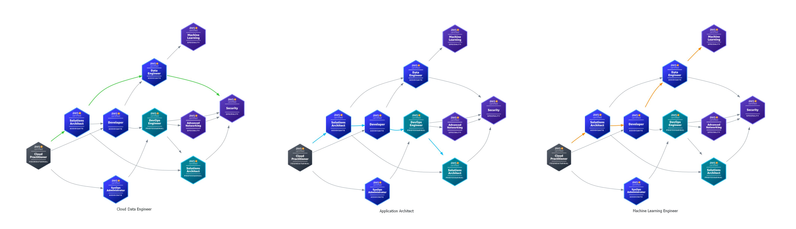

# AWS Certification Skill Tree

As a professional with more than 4 years of experience with AWS, I might attempt to get an [AWS Certification](https://aws.amazon.com/certification/) sooner or later this year, so I'm evaluating all the possibilities out there.

AWS itself provides a useful guide to the recommended [AWS Certification Paths](https://d1.awsstatic.com/training-and-certification/docs/AWS_certification_paths.pdf), where all the top cloud job roles are listed together with a bried description of their responsibilities.

Even if such a resource is more than welcome, I find that the big picture is not as clear as it should be: I decided to help myself building a [skill tree](https://en.wiktionary.org/wiki/skill_tree) with the aid of the awesome [`diagrams`](https://github.com/mingrammer/diagrams).

<!-- more -->

After having manually scraped the internet to get AWS Certification icons[^1], I started experimenting with `diagrams` and I finally came up with this result (click to enlarge).


??? note "Source code"
    ```python
    from diagrams import Cluster, Diagram, Edge
    from diagrams.custom import Custom

    ADVANCED_NETWORKING = "advanced_networking"
    CLOUD_PRACTITIONER = "cloud_practitioner"
    DATA_ENGINEER = "data_engineer"
    DEVELOPER = "developer"
    DEVOPS_ENGINEER = "devops_engineer"
    MACHINE_LEARNING = "machine_learning"
    SECURITY = "security"
    SOLUTIONS_ARCHITECT_ASSOCIATE = "solutions_architect_associate"
    SOLUTIONS_ARCHITECT_PROFESSIONAL = "solutions_architect_professional"
    SYSOPS_ADMIN = "sysops_admin"

    SOURCE = "https://d1.awsstatic.com/training-and-certification/docs/AWS_certification_paths.pdf"


    def build_node(name: str, label: str = "") -> Custom:
        return Custom(
            label=label,
            # This requires you to have an assets folder
            # with the icons named after the above literals
            icon_path=f"./assets/{name}.png",
        )


    with Diagram(
        name=f"AWS Certification Paths\n{SOURCE}",
        filename="aws_certification_paths",
        direction="TB",
    ):
        DiveDeep = Edge(color="magenta", style="dashed")
        with Cluster("Optional for IT/STEM/Cloud professionals"):
            cloud_practitioner = build_node(CLOUD_PRACTITIONER)
        solutions_architect_associate = build_node(SOLUTIONS_ARCHITECT_ASSOCIATE)
        developer = build_node(DEVELOPER)
        sysops_admin = build_node(SYSOPS_ADMIN)
        cloud_practitioner >> solutions_architect_associate
        cloud_practitioner >> developer
        cloud_practitioner >> sysops_admin
        with Cluster("Architecture"):
            with Cluster("Solutions Architect"):
                (
                    solutions_architect_associate
                    >> build_node(SOLUTIONS_ARCHITECT_PROFESSIONAL)
                    >> DiveDeep
                    >> build_node(SECURITY)
                )
            with Cluster("Application Architect"):
                (
                    solutions_architect_associate
                    >> build_node(DEVELOPER)
                    >> build_node(DEVOPS_ENGINEER)
                    >> DiveDeep
                    >> build_node(SOLUTIONS_ARCHITECT_PROFESSIONAL)
                )
        with Cluster("Data Analytics"):
            with Cluster("Cloud Data Engineer"):
                (
                    solutions_architect_associate
                    >> build_node(DATA_ENGINEER)
                    >> DiveDeep
                    >> build_node(SECURITY)
                )
        with Cluster("Development"):
            with Cluster("Software Development/Test Engineer"):
                (developer >> build_node(DEVOPS_ENGINEER))
        with Cluster("Operations"):
            with Cluster("Systems Administrator"):
                (sysops_admin >> DiveDeep >> build_node(DEVOPS_ENGINEER))
            with Cluster("Cloud Security Engineer"):
                (
                    sysops_admin
                    >> build_node(SECURITY)
                    >> DiveDeep
                    >> build_node(DEVOPS_ENGINEER)
                    >> DiveDeep
                    >> build_node(ADVANCED_NETWORKING)
                )
        with Cluster("DevOps"):
            with Cluster("Cloud DevOps Engineer"):
                (
                    developer
                    >> build_node(SYSOPS_ADMIN, label="(Optional)")
                    >> DiveDeep
                    >> build_node(DEVOPS_ENGINEER)
                )
            with Cluster("DevSecOps Engineer"):
                (sysops_admin >> build_node(DEVOPS_ENGINEER) >> build_node(SECURITY))
        with Cluster("Security"):
            with Cluster("Cloud Security Architect"):
                (
                    solutions_architect_associate
                    >> build_node(SECURITY)
                    >> DiveDeep
                    >> build_node(SOLUTIONS_ARCHITECT_PROFESSIONAL)
                )
        with Cluster("Networking"):
            with Cluster("Networking Engineer"):
                (
                    solutions_architect_associate
                    >> build_node(ADVANCED_NETWORKING)
                    >> DiveDeep
                    >> build_node(SECURITY)
                )
        with Cluster("AI/ML"):
            with Cluster("Machine Learning Engineer"):
                (
                    solutions_architect_associate
                    >> build_node(DEVELOPER)
                    >> build_node(DATA_ENGINEER)
                    >> build_node(MACHINE_LEARNING)
                )
    ```

I am mostly a [visual learner](https://en.wikipedia.org/wiki/Visual_learning): the following table shows some property I wanted to retain in the skill tree next to the visual element I chose for the encoding.

| Property | Encoded with |
| -------- | ------------ |
| Optionality of Cloud Practitioner certification | dedicated `diagrams.Cluster` |
| Job area | `diagrams.Cluster` |
| Job title | `diagrams.Cluster` |
| Dive Deep layer | styled `diagrams.Edge` |

With this skill tree available, some considerations are now straightforward:

- after the optional Cloud Practitioner, you basically have three front doors: Solutions Architect, Developer or SysOps Administrator;
- you are expected to know how to architecture first, and only later start implementing;
- the so-called [Security by Design](https://aws.amazon.com/compliance/security-by-design/) approach is enforced also ensuring that many certified professionals have measured themselves with Security specialty;
- the Development, DevOps and Operations paths seem to be more general-purpose than the ones departing from the Solutions Architect front door;
- in this AWS vision, a Machine Learning Engineer is a specialized Cloud Data Engineer;
- these paths suggest that the people building and fine-tuning data solutions should try to stick to their role and to avoid [wearing too many hats](https://en.wiktionary.org/wiki/wear_too_many_hats) (e.g. DevOps certifications are not listed in their paths).

!!! question "Missing Database Specialty"
    I found two other certifications not included in any path: [Data Analytics Specialty](https://aws.amazon.com/certification/certified-data-analytics-specialty/), retiring in Spring 2024, and [Database Specialty](https://aws.amazon.com/certification/certified-database-specialty/), which seems to be still available and with no retirement already planned: why the latter is not included into the Cloud Data Engineer path?

Finally, I tried to answer my original question: which certifications I should try pursuing first? To do so, it's useful reinterpreting the skill tree as a proper graph, e.g. by removing redundant edges and merging redundant nodes. After playing around with `diagrams` options, I highlighted the three paths that look closer to my experience so far (and thus represent the most probable choices I will invest time in): Cloud Data Engineer, Machine Learning Engineer and Application Architect.



The bottom line: there are many suggested ways to reach a given certification, you can either follow these recommended/recognized paths or build your own. Enjoy!

[^1]: The entire collection is already available somewhere for sure, but I didn't search that much.
